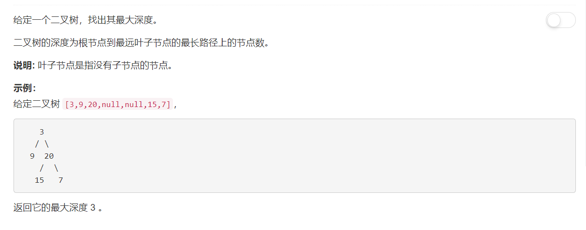

# 104 - 二叉树的最大深度
## 题目描述


>关联题目： [111. 二叉树的最小深度](https://github.com/Rosevil1874/LeetCode/tree/master/Python-Solution/111_Minimum-Depth-of-Binary-Tree)


## 题解一：recursive
**思路：** 递归求解：二叉树的最大深度 = max(左子树的最大深度, 右子树的最大深度) + 1；后面加上的这个1是根节点这一层。

>
1. 时间复杂度：最好的情况树是平衡的，树高为log(N),此时时间复杂度为O(logN)；最坏情况树完全不平衡，树高为N，此时时间复杂度为O(N);  
2. 空间复杂度：O(N).

```python
# Definition for a binary tree node.
# class TreeNode(object):
#     def __init__(self, x):
#         self.val = x
#         self.left = None
#         self.right = None

class Solution(object):
    def maxDepth(self, root):
        """
        :type root: TreeNode
        :rtype: int
        """
        if not root:	# 空树
        	return 0
        return max(self.maxDepth(root.left), self.maxDepth(root.right)) + 1
```


**recursive one-line版：**

```python
class Solution(object):
    def maxDepth(self, root):
        """
        :type root: TreeNode
        :rtype: int
        """
        return max(self.maxDepth(root.left) + self.maxDepth(root.right)) + 1 if root else 0
```


## 题解二：BFS

事实上说成层次遍历更准确一些啦~
>
1. 时间复杂度O(N);
2. 空间复杂度O(N)。

```python
class Solution(object):
    def maxDepth(self, root):
        """
        :type root: TreeNode
        :rtype: int
        """
        depth = 0						# 最大深度
        level = [root] if root else []	# 当前层中包含的树节点
        while level:
        	depth += 1					# 深度加上当前层的1
        	queue = []					# 放置下一层的节点
        	for node in level:			# 遍历这一层所有节点，获取其子节点
        		if node.left:
        			queue.append(node.left)
        		if node.right:
        			queue.append(node.right)
        	level = queue				# 接下来就遍历下一层的子节点啦
        return depth 					# 遍历完之后树的最大深度就求出来啦
```