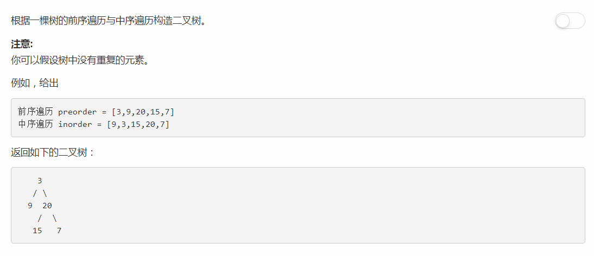

# 105 - 从前序与中序遍历序列构造二叉树
## 题目描述


>关联题目： [106. 从中序与后序遍历序列构造二叉树](https://github.com/Rosevil1874/LeetCode/tree/master/Python-Solution/106_Construct-Binary-Tree-from-Inorder-and-Postorder-Traversal)

## 构造原理
### 1. 遍历算法
1. 前序遍历： 先是根结点，再前序遍历左子树，再前序遍历右子树。
2. 中序遍历： 先中序遍历左子树，再是根结点，再是中序遍历右子树。
3. 后序遍历： 先后序遍历左子树，再是后序遍历右子树，再是根结点。

### 2. 构造二叉树
1. 前序 + 中序
    - 由遍历规则可知，前序遍历的第一个结点为树的根结点。而中序遍历中，以根结点为分界点，左边是左子树结点，右边是右子树结点。
    - 前序遍历的第二个结点为左子树的根结点。以这个结点为分界点，其左边为左子树的左子树结点，右边一直到根结点前一个结点为左子树的右子树结点。
    - 前序遍历的第三个结点为右子树的根结点。以这个结点为分界点，从根结点后一个结点分界点前为右子树的左子树结点，其右边一直到最后一个结点为右子树的右子树结点。
    - 以此类推。。。直到遍历完前序遍历序列，中序也同时遍历完了，二叉树也构建起来了哈哈哈＼＼\٩('ω')و//／／

2. 中序 + 后序

## 一、递归
```python
# Definition for a binary tree node.
# class TreeNode(object):
#     def __init__(self, x):
#         self.val = x
#         self.left = None
#         self.right = None

class Solution(object):
    def buildTree(self, preorder, inorder):
        """
        :type preorder: List[int]
        :type inorder: List[int]
        :rtype: TreeNode
        """
        return self.helper(0, 0, len(inorder) - 1, preorder, inorder) or None

    def helper(self, preStart, inStart, inEnd, preorder, inorder):
        if preStart > len(preorder) - 1 or inStart > inEnd:
            return None

        root = TreeNode(preorder[preStart])
        inIdx = 0           # 当前inorder中的根结点下标
        for i in range(inStart, inEnd + 1):     # 不能在切片数组中使用index确定下标，因为这样下标就是从0开始而不是在[inStart, inEnd]这个范围内了
            if inorder[i] == root.val:
                inIdx = i;
        root.left = self.helper(preStart + 1, inStart, inIdx - 1, preorder, inorder)        
        root.right = self.helper(preStart + inIdx - inStart + 1, inIdx + 1, inEnd, preorder, inorder)
        return root
```

## 二、简版递归
```python
# Definition for a binary tree node.
# class TreeNode(object):
#     def __init__(self, x):
#         self.val = x
#         self.left = None
#         self.right = None

class Solution(object):
    def buildTree(self, preorder, inorder):
        """
        :type preorder: List[int]
        :type inorder: List[int]
        :rtype: TreeNode
        """
        if not preorder or not inorder:
            return None

        root = TreeNode(preorder.pop(0))
        inIdx = inorder.index(root.val)

        root.left = self.buildTree(preorder, inorder[:inIdx])
        root.right = self.buildTree(preorder, inorder[inIdx + 1 :])

        return root
```

## 三、迭代
cr: [The iterative solution is easier than you think!](https://leetcode.com/problems/construct-binary-tree-from-preorder-and-inorder-traversal/discuss/34555/The-iterative-solution-is-easier-than-you-think!)
>idea:
1. Keep pushing the nodes from the preorder into a stack (and keep making the tree by adding nodes to the left of the previous node) until the top of the stack matches the inorder.
2. At this point, pop the top of the stack until the top does not equal inorder (keep a flag to note that you have made a pop).
3. Repeat 1 and 2 until preorder is empty. The key point is that whenever the flag is set, insert a node to the right and reset the flag.

```python
# Definition for a binary tree node.
# class TreeNode(object):
#     def __init__(self, x):
#         self.val = x
#         self.left = None
#         self.right = None

class Solution(object):
    def buildTree(self, preorder, inorder):
        """
        :type preorder: List[int]
        :type inorder: List[int]
        :rtype: TreeNode
        """
        if not preorder or not inorder:
            return None

        stack = []      # 保存val
        nodeStack = []  # 保存结点

        i = j = 0       # i为preorder的下标，j为inorder的下标
        isRight = 0     # 是否右子树
        stack.append(preorder[i])

        # 根结点
        root = TreeNode(preorder[i])
        nodeStack.append(root)
        curr = root
        i += 1

        while i < len(preorder):
            # 子树根结点
            if len(nodeStack) and nodeStack[-1].val == inorder[j]:
                curr = nodeStack[-1]
                nodeStack.pop()
                stack.pop()
                isRight = 1
                j += 1
            elif isRight == 0:
                stack.append(preorder[i])
                curr.left = TreeNode(preorder[i])
                curr = curr.left
                nodeStack.append(curr)
                i += 1
            else:
                isRight = 0
                stack.append(preorder[i])
                curr.right = TreeNode(preorder[i])
                curr = curr.right
                nodeStack.append(curr)
                i += 1
        return root
```