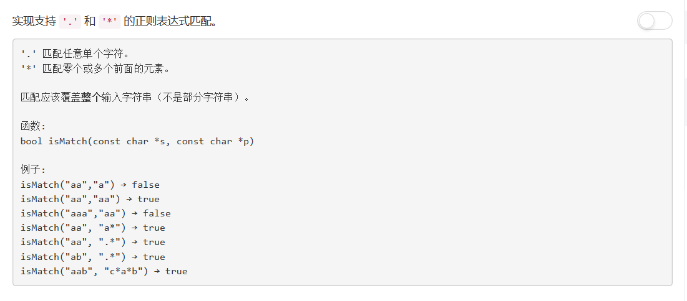

# 10 - 正则表达式匹配

**迷迷糊糊**
**此题有待深究 哦哦哦**

## 题目描述


<!-- more -->

自己的思路：
1. 由于*控制的是其前面字符的匹配，因此可以由正则表达式的末尾开始检查；
2. 没了。。没了。。。直接用字符串的方法肯定是不行的，越想越复杂。。

↓↓别人的思路
## 递归
>cr:[Regular Expression Matching](https://articles.leetcode.com/regular-expression-matching/)

>Think   
carefully how you would do matching of ‘*’. Please note that ‘*’ in regular expression is different from wildcard matching, as we match the previous character 0 or more times. But, how many times? If you are stuck, recursion is your friend.
1. If the next character of p is NOT ‘*’, then it must match the current character of s. Continue pattern matching with the next character of both s and p.
2. If the next character of p is ‘\*’, then we do a brute force exhaustive matching of 0, 1, or more repeats of current character of p… Until we could not match any more characters.


1. 若正则表达式的长度为0，字符串长度也为0时匹配，否则不匹配；
2. 若正则表达式的长度为1，当字符串长度也为1，且两字符相等或表达式为'.'时匹配，否则不匹配；
3. 由于正则表达式中'\*'只能出现在字符后，所以从第二个字符（下标为1）开始判断。
4. 若正则表达式第二个字符非'\*'，且字符串长度为0，不匹配。若其为'\*'，则第一个字符匹配且后面的剩余部分都匹配（这里使用递归判断子串是否匹配）就匹配。
5. 若正则表达式第二个字符为'\*'，则字符串的第一个字符一定是匹配的。接下来递归判断字符串与表达式第三个字符开始的子串是否匹配，若匹配返回True。否则判断字符串第二个字符开始的子串与表达式是否匹配（一个个字符一次与与'\*'匹配）。


```python
class Solution(object):
    def isMatch(self, s, p):
        """
        :type s: str
        :type p: str
        :rtype: bool
        """
        s_len = len(s)
        p_len = len(p)
        if p_len == 0:
            return s_len == 0

        if p_len == 1:
            return s_len == 1 and ( s[0] == p[0] or p[0] == '.' )

        if p[1] != '*':
            if s_len == 0:
                return False
            elif s[0] == p[0] or p[0] == '.':
                return self.isMatch(s[1:], p[1:])
            else:
                return False
        else:
            while len(s) and (s[0] == p[0] or p[0] == '.'):
                if self.isMatch(s, p[2:]):
                    return True        
                s = s[1:]
            return self.isMatch(s, p[2:])
```

## 动态规划
>cr:[leetcode 10 Regular Expression Matching](http://www.voidcn.com/article/p-wzvbljqo-ys.html)

This problem has a typical solution using Dynamic Programming. We define the state P[i][j] to be true if s[0..i) matches p[0..j) and false otherwise. Then the state equations are: 
>1. P[i][j] = P[i - 1][j - 1], if p[j - 1] != ‘*’ && (s[i - 1] == p[j - 1] || p[j - 1] == ‘.’); 
2. P[i][j] = P[i][j - 2], if p[j - 1] == ‘*’ and the pattern repeats for 0 times; 
3. P[i][j] = P[i - 1][j] && (s[i - 1] == p[j - 2] || p[j - 2] == ‘.’), if p[j - 1] == ‘\*’ and the pattern repeats for at least 1 times. 

Putting these together, we will have the following code.

以下代码关于dp[i][j]的定义与以上分析相反，即dp[i][j]为True表示p[0..i) matches s[0..j)。

```python
class Solution:
    def isMatch(self, s, p):
        """
        :type s: str
        :type p: str
        :rtype: bool
        """

        s_len = len(s)
        p_len = len(p)

        # dp[0][0]为True，其他均为False（两个空数组match）
        dp = [[True] + [False] * s_len]
        for i in range(p_len):
            dp.append([False]*(s_len+1))

        for i in range(1, p_len + 1):
            x = p[i-1]
            if x == '*' and i > 1:
                dp[i][0] = dp[i-2][0]
            for j in range(1, s_len+1):
                if x == '*':
                    dp[i][j] = dp[i-2][j] or dp[i-1][j] or (dp[i-1][j-1] and p[i-2] == s[j-1]) or (dp[i][j-1] and p[i-2]=='.')
                elif x == '.' or x == s[j-1]:
                    dp[i][j] = dp[i-1][j-1]

        return dp[p_len][s_len]
```

## 使用第三方库re
一行代码/微笑脸
```python
import re

class Solution:
    def isMatch(self, s, p):
        return re.match('^' + p + '$', s) != None
```