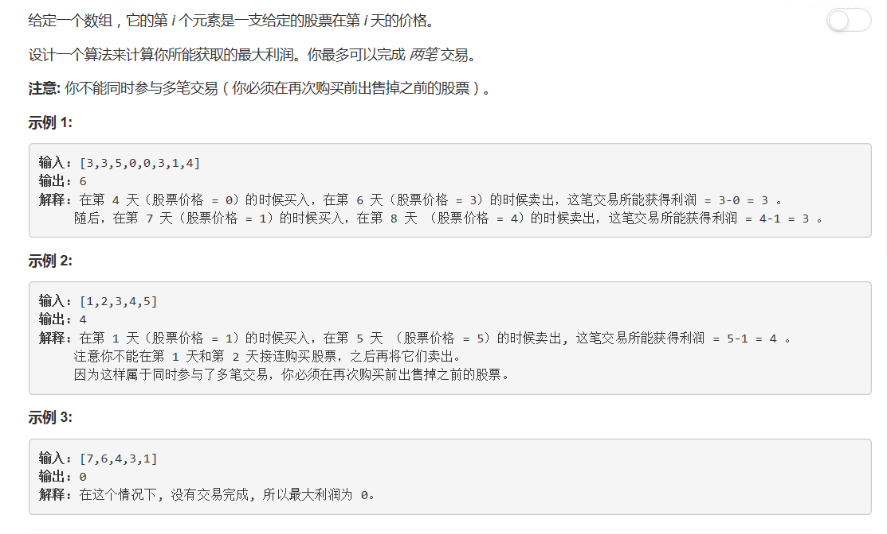

# 123 - 买卖股票的最佳时机III

## 题目描述


>关联题目：  
- [121. 买卖股票的最佳时机](https://github.com/Rosevil1874/LeetCode/tree/master/Python-Solution/121_Best-Time-to-Buy-and-Sell-Stock)
- [122. 买卖股票的最佳时机II](https://github.com/Rosevil1874/LeetCode/tree/master/Python-Solution/122_Best-Time-to-Buy-and-Sell-Stock-II)
- [188. 买卖股票的最佳时机IV](https://github.com/Rosevil1874/LeetCode/tree/master/Python-Solution/188_Best-Time-to-Buy-and-Sell-Stock-IV)
- [309. 买卖股票的最佳时机含冷冻期](https://github.com/Rosevil1874/LeetCode/tree/master/Python-Solution/309_Best-Time-to-Buy-and-Sell-Stock-with-Cooldown)
- [714. 买卖股票的最佳时机含手续费](https://github.com/Rosevil1874/LeetCode/tree/master/Python-Solution/714_Best-Time-to-Buy-and-Sell-Stock-with-Transaction-Fee)

>审题：  
此题与[121. 买卖股票的最佳时机](https://github.com/Rosevil1874/LeetCode/tree/master/Python-Solution/121_Best-Time-to-Buy-and-Sell-Stock)的区别在于：  
上一题要求只进行一次交易，此题是**最多完成两笔交易**，就是说可能是一笔或两笔交易。

## 动态规划
思路：  
简直是brilliant！还可以借钱的啊。  cr: [My explanation for O(N) solution!](https://leetcode.com/problems/best-time-to-buy-and-sell-stock-iii/discuss/39615/My-explanation-for-O(N）-solution!) 
- hold1：一开始没钱，借钱买了这支股票；
- notHold1：卖了刚刚买的这支股票；
- hold2：用刚刚卖第一支股票赚的钱买第二支股票；
- notHold2：卖了第二支股票，剩下的就是最后赚的钱。 

```python
class Solution(object):
    def maxProfit(self, prices):
        """
        :type prices: List[int]
        :rtype: int
        """
        not_hold1 = 0                        
        not_hold2 = 0                         
        hold1 = float('-inf')                
        hold2 = float('-inf')                
        for p in prices:
            hold1 = max(hold1, -p)                  # 借钱买了第一支股票
            not_hold1 = max(not_hold1, hold1 + p)     # 卖了第一支股票
            hold2 = max(hold2, not_hold1 - p)        # 买了第二支股票
            not_hold2 = max(not_hold2, hold2 + p)     # 卖了第二支股票
        return not_hold2
```