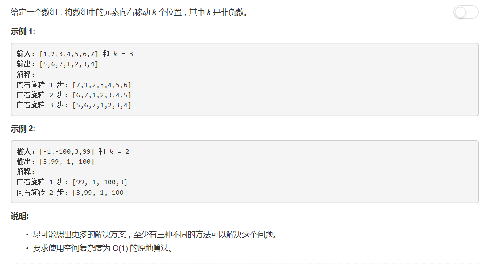

# 189 - 旋转数组

## 题目描述


## 一、旋转
思路：  
把数组末尾的k个元素一个个删除插到头部

```python
class Solution:
    def rotate(self, nums: List[int], k: int) -> None:
        """
        Do not return anything, modify nums in-place instead.
        """
        if k == 0:
            return
        for i in range(k):
            nums[0:0] = [nums.pop()]
```

or
```python
class Solution:
    def rotate(self, nums: List[int], k: int) -> None:
        """
        Do not return anything, modify nums in-place instead.
        """
        if k == 0:
            return
        k = k % len(nums)
        for i in range(k):
            nums.insert(0, nums.pop())
```

## 二、反转
思路：  
先把数组前半部分reverse，然后后半部分reverse，再整个reverse。

```python
class Solution(object):
class Solution:
    def rotate(self, nums: List[int], k: int) -> None:
        """
        Do not return anything, modify nums in-place instead.
        """
        if k == 0:
            return
        
        k = k % len(nums)
        n = len(nums) - 1
        self.reverse(nums, 0, n - k)
        self.reverse(nums, n - k + 1, n)
        self.reverse(nums, 0, n)
        
    def reverse(self, nums: List[int], l:int, r:int):
        while l < r:
            nums[l], nums[r] = nums[r], nums[l]
            l += 1
            r -= 1
```