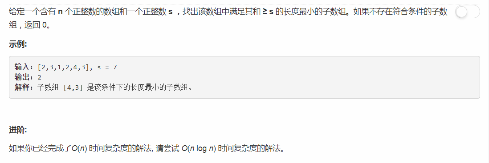

# 209 - 长度最小的子数组

## 题目描述


>关联题目： [718. 最长重复子数组](https://github.com/Rosevil1874/LeetCode/tree/master/Python-Solution/718_Maximum-Length-of-Repeated-Subarray)    

## 一、双指针-第一回合-LOSE
**时间复杂度O(N)**
思路：在和大于s的情况下将两个指针往中间移动，每次从子数组中减掉比较小的那个元素。
```python
class Solution:
    def minSubArrayLen(self, s, nums):
        """
        :type s: int
        :type nums: List[int]
        :rtype: int
        """
        if not len(nums) or sum(nums) < s:
            return 0

        left, right = 0, len(nums) - 1
        while left < right:
            if nums[left] <= nums[right] and sum(nums[left + 1 : right + 1]) >= s:
                left += 1
            elif nums[left] > nums[right] and sum(nums[left : right]) >= s:
                right -= 1
            else:
                return right - left + 1
        return right - left + 1
```
然而，在一个很大的测试集出错了，说明我的代码还是可以正确解答大部分问题的嘛哈哈。


## 二、双指针-第二回合-WIN
**时间复杂度O(N)**
思路：  
start指向子数组头位置，遍历数组，当前位置为结尾位置，若子数组的和大于等于s则将start后移缩短子数组，并随时更新minLen。
```python
class Solution:
    def minSubArrayLen(self, s, nums):
        """
        :type s: int
        :type nums: List[int]
        :rtype: int
        """
        minLen = float('inf')
        start = 0
        tmp = 0
        for i in range(len(nums)):
            tmp += nums[i]
            while tmp >= s:
                minLen = min(minLen, i - start + 1)
                tmp -= nums[start]
                start += 1
        return 0 if minLen == float('inf') else minLen
```

## 三、二分查找
**时间复杂度O(NlogN)**
思路：   
1. 首先遍历数组，计算每前i个元素的和放入nums[i]；
2. 再次遍历数组，若nums[i]大于等于s，则将当前索引i作为子数组的结尾索引；
3. 采用二分查找确定合适的子数组开头索引；
4. 更新最小值。

```python
class Solution:
    def minSubArrayLen(self, s, nums):
        """
        :type s: int
        :type nums: List[int]
        :rtype: int
        """
        # nums[i]为前i个数的和
        for i in range(1, len(nums)):
            nums[i] = nums[i - 1] + nums[i]

        minLen = float('inf')
        start = 0
        for i in range(len(nums)):
            if nums[i] >= s:
                start = self.findStart(start, i, nums[i], nums, s)
                minLen = min(minLen, i - start + 1)
        return 0 if minLen == float('inf') else minLen

    def findStart(self, left, right, sum_i, nums, s):
        while left < right:
            mid = (left + right) // 2
            if sum_i - nums[mid] >= s:
                left = mid + 1
            else:
                right = mid
        return left
```

>ps:  我觉得吧，，，二分比双指针麻烦的不是一点点，为什么此题的作者会提议大家用O(N)解决出来了之后再尝试用O(NlogN)呢？？？


