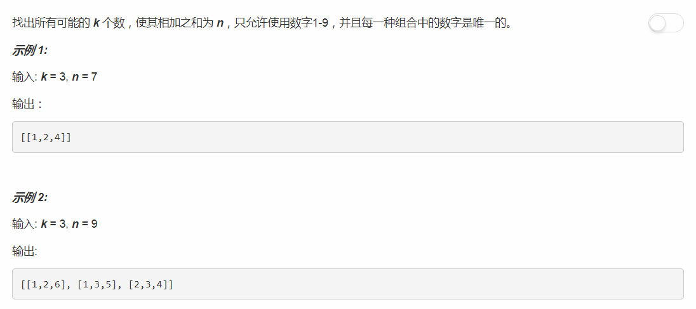

# 216 - 组合总和 III

## 题目描述


>审题：  
1. 相同元素**不可以**重复使用，与39题类似；
2. 解集不包含重复解；
3. 可以在39题基础上控制每个解包含的元素个数。
4. 关联题目[39.组合总数](https://github.com/Rosevil1874/LeetCode/tree/master/Python-Solution/40_Combination-Sum)，[40.组合总数II](https://github.com/Rosevil1874/LeetCode/tree/master/Python-Solution/216_Combination-Sum-II)

## 回溯法

1. 排序，每次加入一个最小值；
2. 将remain = target-sum(tmp), k = k -1作为参数进行递归，避免每次计算解中元素的和以及剩余元素个数；
3. 若remain < 0或k < 0，表示和比n大或个数超过限制；
4. 若remain == 0且k == 0，则找到一个和为n且包括k个元素的解；
5. 使用set过滤重复解。

```python
class Solution(object):
    def combinationSum3(self, k, n):
        """
        :type k: int
        :type n: int
        :rtype: List[List[int]]
        """
        res = set()
        candidates = [1,2,3,4,5,6,7,8,9]
        self.backtrack(res, [], candidates, n, k, 0)
        return list( map(list, res) )

    def backtrack(self, res, tmp, candidates, remain, k, start):
        if remain < 0 or k < 0:
            return
        elif remain == 0 and k == 0:
            res.add(tuple(tmp))
        else:
            for i in range(start, len(candidates)):
                if candidates[i] > remain:      # 剪枝
                    break
                # tmp.append(candidates[i])     # tmp按引用传递，直接这样append会导致最后res中的解全部是最后一个tmp的值
                self.backtrack(res, tmp + [candidates[i]], candidates, remain - candidates[i], k - 1, i+1) #不可以重复使用同一元素，start递增

```

## 小tip
1. set和dict很像，唯一区别是不存储value；
2. set的元素必须是不变对象；
3. 使用set过滤重复数组时，由于list是可变对象，不能作为set的元素，可以先将其转化为不变的tuple,最后再依次转换回list。
