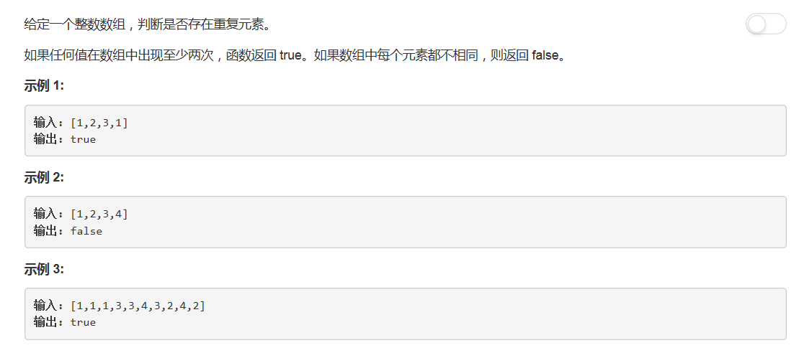

# 217 - 存在重复元素

## 题目描述


>关联题目： [219. 存在重复元素II](https://github.com/Rosevil1874/LeetCode/tree/master/Python-Solution/219_Contains-Duplicate-II)  
>关联题目： [220. 存在重复元素III](https://github.com/Rosevil1874/LeetCode/tree/master/Python-Solution/219_Contains-Duplicate-III)  

## 排序

**思路**
1. 将数组排序；
2. 遍历，若出现重复立即返回True；
3. 若遍历完还没有重复，返回False。

>时间复杂度O(n * logn)-排序，空间复杂度O(1)

```python
class Solution(object):
    def containsDuplicate(self, nums):
        """
        :type nums: List[int]
        :rtype: bool
        """
        if len(nums) == 0 or len(nums) == 1:
        	return False

        nums.sort()
        for i in range(1, len(nums)):
        	if nums[i] == nums[i - 1]:
        		return True
        return False
```

## 集合
**思路**
1. 建立一个空的set；
2. 遍历，若集合中存在即出现重复，立即返回True，否则为第一次出现，加入集合；
3. 若遍历完还没有重复，返回False。

>时间复杂度O(n)，空间复杂度O(1)

```python
class Solution(object):
    def containsDuplicate(self, nums):
        """
        :type nums: List[int]
        :rtype: bool
        """
        if len(nums) == 0 or len(nums) == 1:
        	return False

        s = set()
        for i in range(len(nums)):
        	if nums[i] in s:
        		return True
        	s.add(nums[i])
        return False
```

这个方法还有一个大神的一行代码:
```python
class Solution(object):
    def containsDuplicate(self, nums):
        """
        :type nums: List[int]
        :rtype: bool
        """
        return len(nums) != len(set(nums))
```