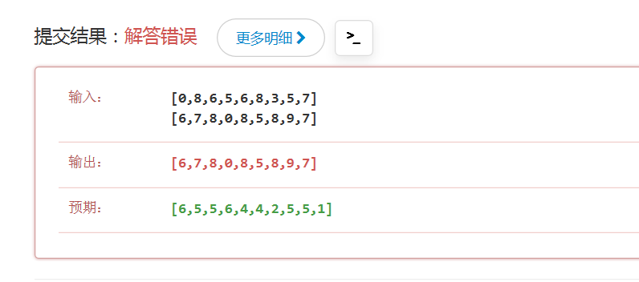

# 2 - 两数相加

## 题目描述


<!-- more -->


## 第一次尝试【链表->数字->链表】
思路一：
1. 两个函数：链表->数字，数字->链表；
2. 分别将两个加数链表化为数字相加；
3. 将和化为链表返回。

思路二：
1. 由于链表是高低位反向表示数字的，所以第一个结点是个位，第二个结点是十位...
2. 同时遍历两个链表，每往后走一个结点就扩大十倍，同时在这里做加法；
3. 步骤二直到两个链表遍历结束；
4. 将和转化为链表返回。

写了思路一，思路二和思路一大同小异，不写了，懒_(°ω°｣∠)_

```python
# Definition for singly-linked list.
class ListNode:
    def __init__(self, x):
        self.val = x
        self.next = None

class Solution:
    def addTwoNumbers(self, l1, l2):
        """
        :type l1: ListNode
        :type l2: ListNode
        :rtype: ListNode
        """
        num1 = self.LinkedListToNum(l1)
        num2 = self.LinkedListToNum(l2)
        num = num1 + num2
        return self.NumToLinkedList(num)

    def LinkedListToNum(self, head):
    	num = 0
    	multiple = 1	#倍数
    	if head.val == 0 and head.next == None:
    		return 0
    	while head.next is not None:
    		num += head.val * multiple
    		head = head.next
    		multiple *= 10
    	num += head.val * multiple
    	return num
    		
    def NumToLinkedList(self, num):
    	if num == 0:
    		return ListNode(0)
    	else:
    		v = num % 10
    		num = num // 10
    		head = ListNode(v)
    		curr = head
    		while num != 0 :
	    		v = num % 10
	    		num = num // 10
	    		curr.next = ListNode(v)
	    		curr = curr.next
	    	return head
```


## debug

原因：链表转数字的时候判断有误，看到人家头结点val==0直接就一票否决返回0了。
```python
if head.val == 0:
    return 0
```
解决：应该再判断是不是只有这一个结点啊喂，只有一个val为0的结点的话是0没错，但只有最后一位是0有何不可啊。
```python
if head.val == 0 and head.next == None:
    return 0
```

## 第二次尝试【加法进位】

那么，就按加法运算法则来一位一位地相加进位吧;
emmmm..虽然思路是有的但是看到人家的只有几行就运过来了(〃ﾉωﾉ)

```python
# Definition for singly-linked list.
# class ListNode:
#     def __init__(self, x):
#         self.val = x
#         self.next = None

class Solution:
    def addTwoNumbers(self, l1, l2):
        """
        :type l1: ListNode
        :type l2: ListNode
        :rtype: ListNode
        """
        head = ListNode(0)
        curr = head
        carry = 0		# 进位
        while l1 is not None or l2 is not None or carry != 0:
        	num = (l1.val if l1 else 0) + (l2.val if l2 else 0) + carry
        	carry = num // 10
        	curr.next = ListNode( num % 10 )
        	curr = curr.next
        	l1 = l1.next if l1 else l1
        	l2 = l2.next if l2 else l2
        return head.next
```

## 人家的coding
和我第一个代码的思路大致一样，就是其中的实现比较简单，人家就是人家，人家永远比你聪明哈哈哈o(╥﹏╥)o
cr: [两个用链表表示的数字相加](https://segmentfault.com/a/1190000010009315)

思路：
1. 将链表整体转成str，再reverse
2. reverse之后转成int相加，得到re
3. re再次reverse之后，循环转成链表

```python
# Definition for singly-linked list.
class ListNode(object):
    def __init__(self, x):
        self.val = x
        self.next = None

class Solution(object):
    def addTwoNumbers(self, l1, l2):
        """
        :type l1: ListNode
        :type l2: ListNode
        :rtype: ListNode
        """
        s1 = self.genS(l1)
        s2 = self.genS(l2)
        re = str(int(s1) + int(s2))[::-1]
        tmp = result = ListNode(int(re[0]))
        for i in range(1, len(re)):
            tmp.next = ListNode(int(re[i]))
            tmp = tmp.next
        return result

    def genS(self, li):
        s = ''
        while li:
            s += str(li.val)
            li = li.next
        return s[::-1] 			#新技能get：翻转字符串
```