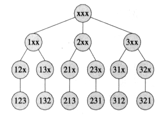
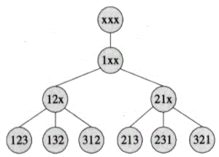

# 31 - 下一个排列

## 题目描述


>审题：
1. 原地操作，无返回值；
2. 常数额外空间。
3. 可以这样理解：输入一个整数数组，该数组按照下标顺序代表一个整数，如[1,2,3]代表123，找出以这个数组元素为数位的，比当前这个数字大的数中的最小值，若当前已经是最大值，则输出最小值（升序）。

## 全排列
>cr: [递归解决全排列生成算法](https://segmentfault.com/a/1190000000666583)

集合{ 1,2,3}的全排列为：
- { 1 2 3 }
- { 1 3 2 }
- { 2 1 3 }
- { 2 3 1 }
- { 3 2 1 }
- { 3 1 2 }

1. 递归：排列枚举树

2. 循环


## 题解
>cr : [leetcode31 Next Permutation](https://segmentfault.com/a/1190000009435816)

思路：
1. 从后往前遍历，倒数第二位开始，找到可以替换的最小值；
2. 对每一位，从前往后找一个比当前值大的数中的最小值，与当前进行替换；
3. 替换后保证后续序列为升序（最小）。

```python
class Solution(object):
    def nextPermutation(self, nums):
        """
        :type nums: List[int]
        :rtype: void Do not return anything, modify nums in-place instead.
        """
        l = len(nums)
        i = l - 2
        while i >= 0:
            for j in range(i+1, l):
                if nums[i] < nums[j]:
                    nums[i], nums[j] = nums[j], nums[i]
                    nums[i+1:] = sorted(nums[i+1:])
                    return
            # 当前位不可替换，则对后面的元素排序，以直接找到大值中的最小值
            nums[i:] = sorted(nums[i:])
            i -= 1
        nums[0:].sort()
```