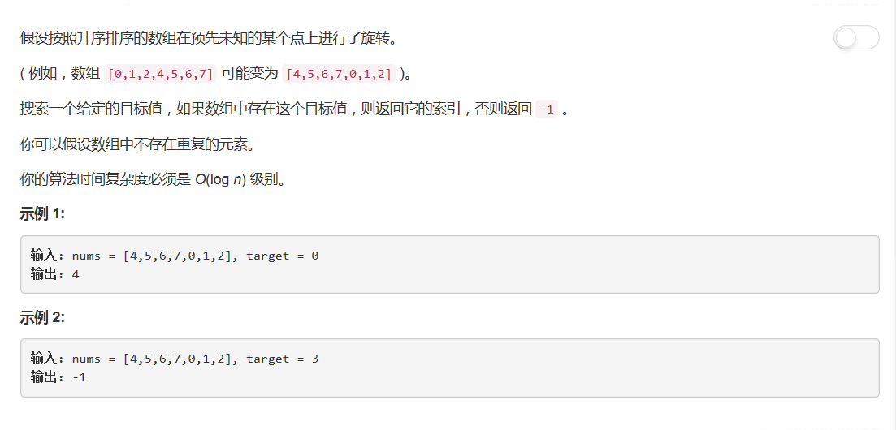

# 33 - 搜索旋转排序数组

## 题目描述


>审题：
1. 返回目标索引，不存在则返回-1；
2. 时间复杂度O(log n)。

## 一、简单判断法
**时间复杂度O(n)**  
思路：
由于时间复杂度限制到了O(log n)，不能先排序，关键在于旋转点。旋转点左边子序列大于右边子序列。可以判断target，若其大于nums[0]，则从前往后查找，否则从后往前查找。  

```python
class Solution(object):
    def search(self, nums, target):
        """
        :type nums: List[int]
        :type target: int
        :rtype: int
        """
        l = len(nums)
        if not l:
        	return -1

        if nums[0] == target:
        	return 0
        elif nums[0] > target:
        	i = l - 1
        	while i >= 0 and nums[i] != target:
        		i -= 1
        	return i
        else:
        	i = 1
        	while i < l and nums[i] != target:
        		i += 1
        	if i == l:
        		return -1
        	else:
        		return i
```

## 二、二分查找法
**时间复杂度O(log n)**  

思路：
1. 先将数组二分，判断target与nums[mid]的关系，若target == nums[mid]，直接返回下标，否则进入第二步；
2. 若nums[left] <= nums[mid]，则左子序列是排好序的。同时若target > nums[left] and target < nums[mid]，则且target在其中，对左子序列二分查找即可；否则从第一步开始递归处理右侧旋转数组。
3. 若nums[mid] <= nums[right]，则右子序列是排好序的。同时若target > nums[mid] and target < nums[right]，则target在其中，对右子序列二分查找即可；否则从第一步开始递归处理左侧旋转数组。

```python
class Solution(object):
    def search(self, nums, target):
        """
        :type nums: List[int]
        :type target: int
        :rtype: int
        """
        left, right = 0, len(nums) - 1
        while left <= right:
        	mid = (left + right) // 2
        	if target == nums[mid]:
        		return mid
        	elif nums[left] <= nums[mid]:
        		if target >= nums[left] and target < nums[mid]:
        			right = mid - 1
        		else:
        			left = mid + 1
        	else:
        		if target > nums[mid] and target <= nums[right]:
        			left = mid + 1
        		else:
        			right = mid - 1
        return -1
```