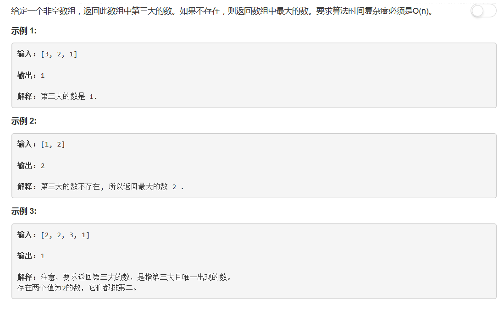

# 414 - 第三大的数

## 题目描述


>关联题目： [215. 数组中的第K个最大元素](https://github.com/Rosevil1874/LeetCode/tree/master/Python-Solution/215_Kth-Largest-Element-in-an-Array)  


## 解法一
思路：  
1. 首先利用set去重；
2. 使用top， second， third分别记录最大、第二大和第三大的数，初始化为负无穷；
3. 遍历数组，更新三个变量。
```python
class Solution(object):
    def thirdMax(self, nums):
        """
        :type nums: List[int]
        :rtype: int
        """
        nums = list(set(nums))
        top = second = third = -float('inf')
        for x in nums:
            if x > top:
                third = second
                second = top
                top = x
            elif x > second:
                third = second
                second = x
            elif x > third:
                third = x

        if third != -float('inf'):
            return third
        elif top != -float('inf'):
            return top
        else:
            return None
```

## 解法二
其实思路和解法一是一样的，不过习惯性会去看看大神是怎么解决一道题的，所以就算思路一样，大神的代码也是优雅得多呀。  
参考： [Intuitive and Short Python solution](https://leetcode.com/problems/third-maximum-number/discuss/90207/Intuitive-and-Short-Python-solution)

```pyhton
class Solution(object):
    def thirdMax(self, nums):
        """
        :type nums: List[int]
        :rtype: int
        """
        box = [float('-inf'), float('-inf'), float('-inf')]
        for x in nums:
            if x not in box:
                if x > box[0]:
                    box = [x, box[0], box[1]]
                elif x > box[1]:
                    box = [box[0], x, box[1]]
                elif x > box[2]:
                    box = [box[0], box[1], x]
        return max(nums) if float('-inf') in box else box[2]
```

PS: 非常喜欢大家用**优雅**来形容好的代码。

