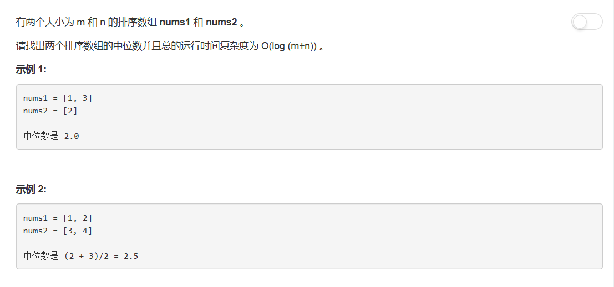

# 4 - 两个排序数组的中位数

## 题目描述


<!-- more -->

## 方法一：先合并
思路：
1. 合并两个有序数组；
2. 排序；
3. 找中位数；
4. but 这样的话原本的数组有不有序又有什么关系呢。。。
5. 时间复杂度O(m+n)

```python
class Solution:
    def findMedianSortedArrays(self, nums1, nums2):
        """
        :type nums1: List[int]
        :type nums2: List[int]
        :rtype: float
        """
        m = len(nums1)
        n = len(nums2)
        nums1.extend(nums2)
        nums1 = sorted( nums1 )
        l = len(nums1)
        if l % 2 == 1:
        	return nums1[l//2]
        else:
        	return ( nums1[l//2-1] + nums1[l//2] ) / 2
```

## 方法二：二分查找
> cr:[两个排序数组的的中位数](https://zhuanlan.zhihu.com/p/33168674)

思路：
1. 中位数的性质: 在有序的有限数集中，在中位数左边的数的个数与右边的相等。
2. 这个问题可以进一步转化为在nums1数组抽前i个数在nums2数组中抽前j个数，且
`i+j == halflen, (halflen = (m+n+1)/2)`
（在奇数情况下左边的数比右边多一个）。
3. 二分查找i，通过等式得到
`j = halflen − i`，然后判断是否能满足中位数的条件。
4. 为了方便起见，同时减少运算次数，我们把数组size小的放到nums1，大的放到nums2，然后从nums1中查找i。
5. 进一步缩小查找范围，对于任意取的值i，我们能得到下面这张图中的关系。绿色的代表左边的数字，黄色的代表的是右边的数字。


```python
class Solution:
    def findMedianSortedArrays(self, nums1: List[int], nums2: List[int]) -> float:
        m, n = len(nums1), len(nums2)
        
        # 根据数组大小交换顺序，小的在前
        if m > n:
            m, n = n, m
            nums1, nums2 = nums2, nums1
        
        imin, imax = 0, m       # nums1剩余部分的起止坐标
        half_len = (m + n + 1) // 2
        
        # 二分查找i值
        while imin <= imax:
            i = (imin + imax) // 2    # nums1剩余部分的中间位置
            j = half_len - i          # nums2中的j个数加上i刚好为合并序列的中间个数
            if i < m and nums1[i] < nums2[j - 1]:   # i左边的数均在中位数左边，可排除
                imin = i + 1
            elif i > 0 and nums1[i - 1] > nums2[j]: # i右边的数均在中位数右边，可排除
                imax = i - 1
            else:
                # 左边最大值
                if not i:
                    max_of_left = nums2[j-1]
                elif not j:
                    max_of_left = nums1[i-1]
                else:
                    max_of_left = max(nums1[i-1], nums2[j-1])
                # 如果总为奇数直接返回左边最大值
                if (m + n)%2 == 1:
                    return max_of_left
                # 右边最小值
                if i == m:
                    min_of_right = nums2[j]
                elif j == n:
                    min_of_right = nums1[i]
                else:
                    min_of_right = min(nums1[i], nums2[j])
                return (max_of_left + min_of_right) / 2
        return 0
```