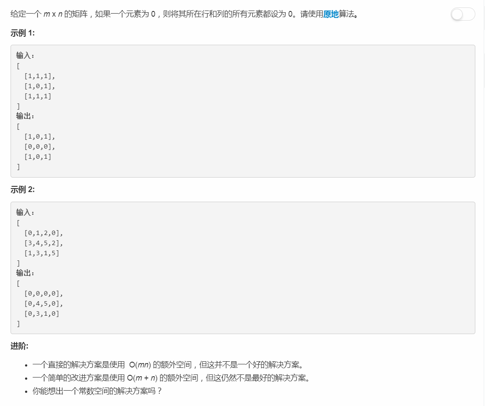

# 73 - 矩阵置零

## 题目描述



## 解法一
**空间复杂度max{O(m), O(n)}**

思路：
1. 遍历矩阵，遇到0元素则分别将其横纵坐标加入集合row、col；
2. 遍历集合row，将其代表的每一行置零；
3. 遍历集合col，将其代表的每一列置零。

```python
class Solution:
    def setZeroes(self, matrix: List[List[int]]) -> None:
        """
        Do not return anything, modify matrix in-place instead.
        """
        if not matrix:
            return matrix
        m, n = len(matrix), len(matrix[0])
        row, col = set(), set()
        
        # 找出所有出现0的行列索引
        for i in range(m):
            for j in range(n):
                if matrix[i][j] == 0:
                    row.add(i)
                    col.add(j)
        
        # 将出现0的行列全部置零
        for r in row:
            matrix[r] = [0] * n
        for c in col:
            for i in range(m):
                matrix[i][c] = 0
```

## 解法二
**空间复杂度O(1)**

思路：
1. 把状态保存在第一行和第一列，即零元素所在行的第一个元素和所在列的第一个元素置零；
2. 使用单独的变量row0和col0保存第一行和第一列的状态；
3. 检查状态，根据状态改变矩阵。

```python
class Solution:
    def setZeroes(self, matrix: List[List[int]]) -> None:
        """
        Do not return anything, modify matrix in-place instead.
        """
        if not matrix:
            return matrix
        m, n = len(matrix), len(matrix[0])
        row0 = col0 = 1     # 第一行和第一列的状态
        
        # 第一次遍历：检查矩阵中的0，并作标记
        for i in range(m):
            for j in range(n):
                if matrix[i][j] == 0:
                    # 如果是第一行或第一列的元素为0，将其状态单独保存
                    if i == 0:
                        row0 = 0
                    if j == 0:
                        col0 = 0
                    # 将出现0的行列第一个元素置零
                    matrix[0][j] = matrix[i][0] = 0
                
        # 第二次遍历：将行首或列首标记为0的行列全部置零
        for i in range(1, m):
            for j in range(1, n):
                if matrix[0][j] == 0 or matrix[i][0] == 0:
                    matrix[i][j] = 0
        
        # 若第一行或第一列出现0，将其元素全部置零
        if row0 == 0:
            matrix[0] = [0] * n
        if col0 == 0:
            for i in range(m):
                matrix[i][0] = 0
```