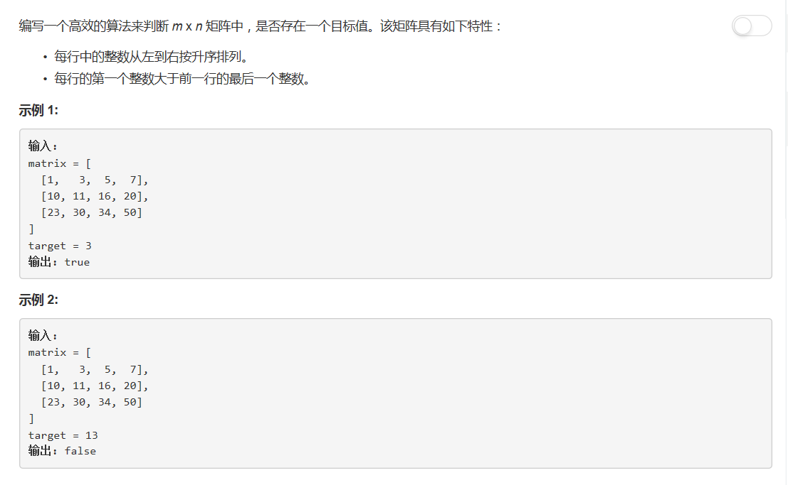

# 74 - 搜索二维矩阵

## 题目描述


>关联题目： [240. 搜索二维矩阵II](https://github.com/Rosevil1874/LeetCode/tree/master/Python-Solution/240_Search-a-2D-Matrix-II)  

## 二分查找
**根据矩阵的有序特点采用二分查找**

思路：
1. 特殊情况返回false：
    1. 矩阵不存在：None；
    2. 矩阵是一维空矩阵：[]；
    3. 矩阵是二维空矩阵：[[]]。
2. 遍历矩阵每一行，根据target与首尾元素的大小关系判断target是否在此行：
    1. 若target在此行，二分查找，若找到返回true；
    2. 若遍历完矩阵都不包括target，返回false。

```python
class Solution(object):
    def searchMatrix(self, matrix, target):
        """
        :type matrix: List[List[int]]
        :type target: int
        :rtype: bool
        """
        if not matrix:
            return False
        m = len(matrix)
        n = len(matrix[0])
        if m == 0 or n == 0:
            return False

        for i in range(m):
            if target >= matrix[i][0] and target <= matrix[i][n-1]:
                # 二分法查找
                left = 0
                right = n - 1
                while left <= right:
                    mid = (left + right) // 2
                    if matrix[i][mid] == target:
                        return True
                    elif matrix[i][mid] > target:
                        right = mid - 1
                    else:
                        left = mid + 1
        return False
```

## 降维 + 二分查找
**矩阵从上到下，从左至右升序排列，可将其看做一个一维有序数组**

思路：
1. m: 矩阵每一行的元素个数
2. n * m 矩阵转一维数组： matrix[i][j] => a[i * m + j]
3. 一维数组转n * m 矩阵： a[i] => matrix[i / m][i % m]

```python
class Solution(object):
    def searchMatrix(self, matrix, target):
        """
        :type matrix: List[List[int]]
        :type target: int
        :rtype: bool
        """
        if not matrix:
            return False
        n = len(matrix)
        m = len(matrix[0])
        if m == 0 or n == 0:
            return False

        # 二分法查找
        left = 0
        right = n * m - 1
        while left <= right:
            mid = (left + right) // 2
            if matrix[mid // m][mid % m] == target:
                return True
            elif matrix[mid // m][mid % m] > target:
                right = mid - 1
            else:
                left = mid + 1
        return False
```

## trick

从矩阵的右上角开始查找

```python
class Solution:
    def searchMatrix(self, matrix: List[List[int]], target: int) -> bool:
        if not matrix:
            return False
        
        m, n = len(matrix), len(matrix[0])
        i, j = 0, n - 1
        while i < m and j >= 0:
            if target < matrix[i][j]:
                j -= 1
            elif target > matrix[i][j]:
                i += 1
            else:
                return True
        return False
```